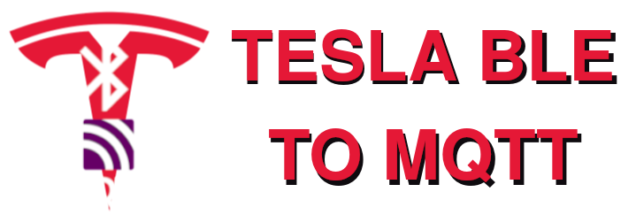

# Tesla Ble to Mqtt addon repository

This repository contains the Tesla Ble to Mqtt addon. Tesla Ble to Mqtt is a project that bridges Tesla data over Bluetooth low energy (BLE) to an MQTT broker. This allows you to control and monitor your Tesla vehicle using from Home assistant.

> [!IMPORTANT]
> If you are having trouble with regular version of the addon not working, you can try installing the [Full access] version,
> which will give the container full hardware access. Only try this after you tried the regular version, and have made sure
> that the regular version is stopped (or uninstalled). 

